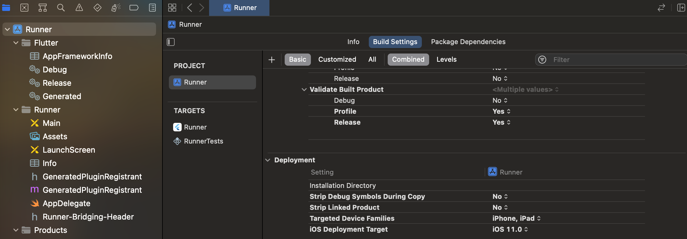

# Setup

## IOS

- Open `ios/Runner.xcodeproj` with Xcode
- Click `Runner`, select `Build Settings`
- Select `Basic` and `Combined`
- Find the `Deployment` section
- Set `Strip Linked Product` to `No`

